Math 50 Fall 2017, Homework \#5
================

## Normal probability plots

You can use `qqnorm` and `qqline` functions to plot probability plots of
residuals. The functions `rstandard` and `rstudent` calculate the
standardized residuals and R-student residuals, respectively.

``` r
prop = read.table("https://math.dartmouth.edu/~m50f17/propellant.csv", header=T, sep=",")
age <- prop$Age
shearS <- prop$ShearS

fitted = lm(shearS ~ age)

stdRes = rstandard(fitted)
rStuRes = rstudent(fitted)

qqnorm(rStuRes, main="Normal Probability Plot (residuals on vertical axis)") 
qqline(rStuRes)
```

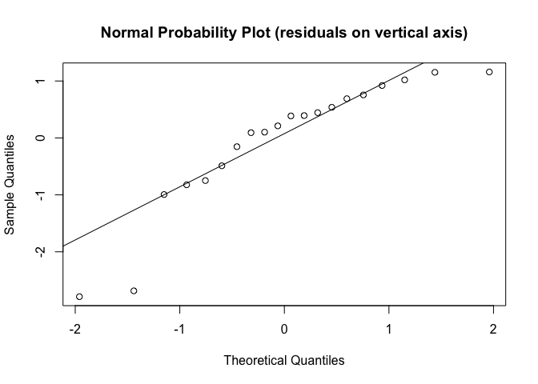<!-- -->

However, note that the book uses residuals on the *x*-axis instead of *y*-axis. In order to obtain that use the parameter datax as shown below. In the below graph *x*-axis denotes the R-student residuals and the *y*-axis is the theoretical quantiles ( in the book *y*-axis is probability instead of quantiles).

``` r
qqnorm(rStuRes, datax = TRUE ,
       main="Normal Probability Plot") 
qqline(rStuRes)
```

<!-- -->

### Residual vs predicted response plot

``` r
yHat <- predict(fitted)
plot (yHat, rStuRes)
abline(0,0)
```

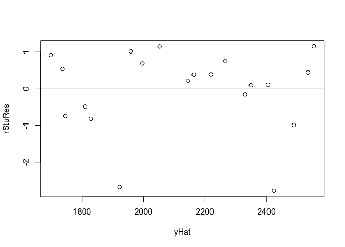<!-- -->

After observing that the observation points 5 and 6 look like potential outliers, next we delete those points and compare the fitted model of the deleted data with the full data.

``` r
plot(age, shearS, xlim=c(0,30), ylim=c(1600,2700))
abline(fitted$coef, lwd = 2, col = "blue")

ageRem <- age[-6] 
ageRem <- ageRem[-5] 

shearSRem <- shearS[-6]
shearSRem <- shearSRem[-5]

fitted2 = lm(shearSRem ~ ageRem)
abline(fitted2$coef, lwd = 2, col = "red")
```

<!-- -->

### A note

There is a dedicated library :

MPV: Data Sets from Montgomery, Peck and Vining’s Book

in order to provide an easy way to load tables from the book. To install the library type :

``` r
install.packages(“MPV”)
```

Below is an example how to use this library. Check
<https://cran.r-project.org/web/packages/MPV/MPV.pdf> for table names.

``` r
library(MPV)
```

    ## Loading required package: lattice

    ## Loading required package: KernSmooth

    ## KernSmooth 2.23 loaded
    ## Copyright M. P. Wand 1997-2009

``` r
data(table.b1)

y <- table.b1$y
x1 <- table.b1$x1
x3 <- table.b1$x3
x8 <- table.b1$x8

y.lm <- lm(y ~ x1 + x3 + x8)
summary(y.lm)
```

    ## Call:
    ## lm(formula = y ~ x1 + x3 + x8)
    ## 
    ## Residuals:
    ##     Min      1Q  Median      3Q     Max 
    ## -3.6835 -1.5609 -0.1448  1.7188  4.0386 
    ## 
    ## Coefficients:
    ##              Estimate Std. Error t value Pr(>|t|)   
    ## (Intercept) 12.136744   9.145612   1.327  0.19698   
    ## x1           0.001123   0.001938   0.580  0.56762   
    ## x3           0.159582   0.296318   0.539  0.59516   
    ## x8          -0.006496   0.002088  -3.112  0.00475 **
    ## ---
    ## Signif. codes:  0 '***' 0.001 '**' 0.01 '*' 0.05 '.' 0.1 ' ' 1
    ## 
    ## Residual standard error: 2.42 on 24 degrees of freedom
    ## Multiple R-squared:  0.5702, Adjusted R-squared:  0.5164 
    ## F-statistic: 10.61 on 3 and 24 DF,  p-value: 0.0001244

## Question-1

Solve the parts (a), (b) and (c) of Problem 4.1. In addition answer the following.

### Part (a)

``` r
library(MPV)
data(table.b1)
y <- table.b1$y
x2 <- table.b1$x2
x8 <- table.b1$x8

fitted <- lm(y ~ x8)
stdRes = rstandard(fitted)
rStuRes = rstudent(fitted)
qqnorm(rStuRes,main="Normal Probability Plot (residuals on y-axis)") 
qqline(rStuRes)
```

<!-- -->

``` r
qqnorm(rStuRes, datax = TRUE, main="Normal Probability Plot")
qqline(rStuRes, datax = TRUE)
```

<!-- -->

Most r-student residuals stay close to the line, therefore the normality assumption seems to be in check.

### Part (b)

``` r
plot (predict(fitted), rStuRes, main = "Residuals vs. Predicted Response")
abline(0,0)
```

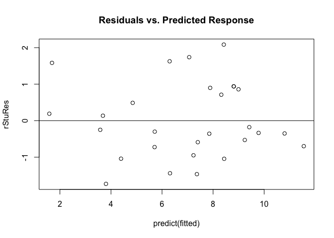<!-- -->

Residuals are contained within horizontal bands, therefore roughly constant variance. No apparent problems in model.

### Part (c)

``` r
plot (x2, rStuRes, main = "Residuals vs. Team Passing Yardage (x2)")
abline(0,0)
```

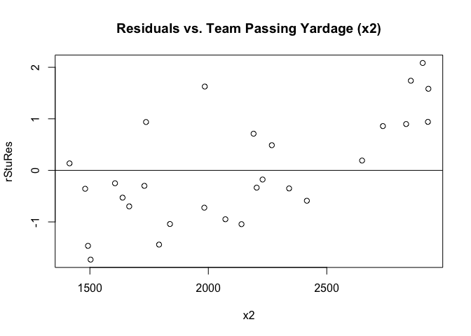<!-- -->

A structure appears in the graph (upward trend in r-student residuals as
*x*<sub>2</sub> increases), therefore the model would be improved by adding *x*<sub>2</sub> as a
regressor.

### Part (d) Is it possible to perform lack of fit test using the steps (4.20) to (4.24) ?

It is not possible to perform lack of fit test using steps 4.20 to 4.24 because there would need to exist multiple readings of *y* for constant *x*<sub>2</sub> and *x*<sub>8</sub> values, which is not the case for the data in this problem.

## Question-2

Chapter 4, Problem 2 all parts.

### Part (a)

``` r
library(MPV)
library(MASS)
```

    ## 
    ## Attaching package: 'MASS'

    ## The following object is masked from 'package:MPV':
    ## 
    ##     cement

``` r
data(table.b1)
y <- table.b1$y
x2 <- table.b1$x2
x7 <- table.b1$x7
x8 <- table.b1$x8

fitted <- lm(y ~ x2+ x7+x8)
stdRes = rstandard(fitted)
studentRes = studres(fitted)
rStuRes = rstudent(fitted)
qqnorm(rStuRes, main="Normal Probability Plot (residuals on y-axis)") 
qqline(rStuRes)
```

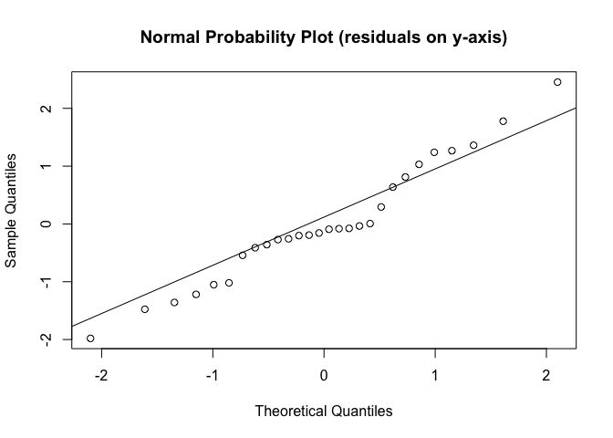<!-- -->

``` r
qqnorm(rStuRes, datax = TRUE, main="Normal Probability Plot")
qqline(rStuRes, datax = TRUE)
```

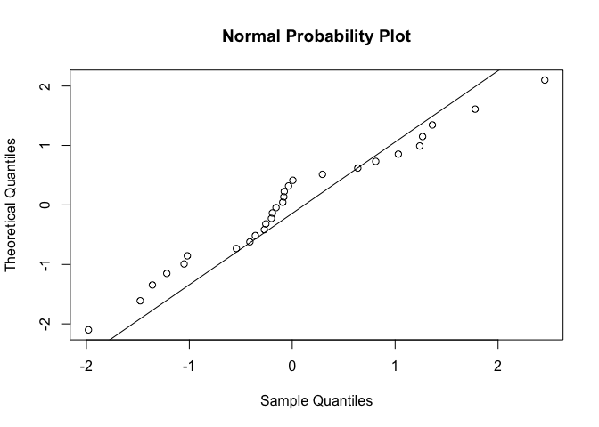<!-- -->

Plot does not follow the line well particularly for near-zero residuals, there is a minor problem with the normality assumption.

### Part (b)

``` r
plot (predict(fitted), rStuRes, main="Residuals vs. Predicted Response")
abline(0,0)
```

<!-- -->

The residuals are contained within horizontal bands, there is roughly constant variance in the data.

### Part (c)

``` r
plot (x2, rStuRes, main="Residuals vs. x2")
abline(0,0)
```

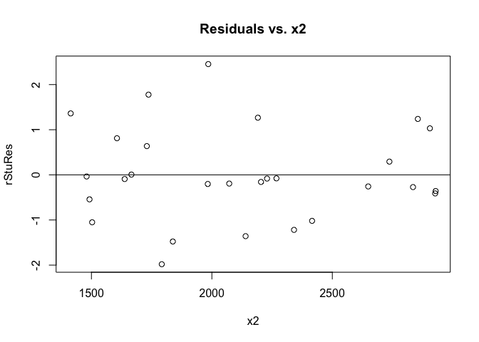<!-- -->

``` r
plot (x7, rStuRes, main="Residuals vs. x7")
abline(0,0)
```

<!-- -->

``` r
plot (x8, rStuRes, main="Residuals vs. x8")
abline(0,0)
```

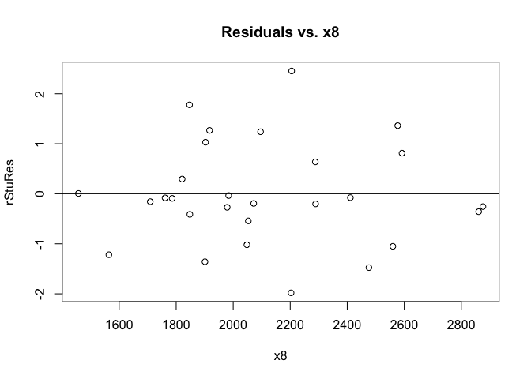<!-- -->

There appears to be a structure in the residuals *x*<sub>7</sub> plot, implying non-constant variance and that the relationship between *y* and *x*<sub>7</sub> is
nonlinear. Therefore regressor *x*<sub>7</sub> is not correctly specified. However the other two plots, for *x*<sub>2</sub> and *x*<sub>8</sub>, do not exhibit as obvious of structures, implying constant variance and that the relationships between *y* and each regressor are linear. So regressors *x*<sub>2</sub> and *x*<sub>8</sub> should be correctly specified. Note: We are a little less certain with
specification for *x*<sub>2</sub> because its residuals graph narrows slightly near *x*<sub>2</sub> = 2500.

### Part (d)

``` r
fitted = lm(y ~ x7 + x8)
yHat = predict(fitted)
ei_y_given_x2 = y - yHat
fitted = lm(x2 ~ x7 + x8)
yHat = predict(fitted)
ei_x2_given_x7_x8 = x2 - yHat
plot(ei_x2_given_x7_x8, ei_y_given_x2, main="Marginal Role for x2")
```

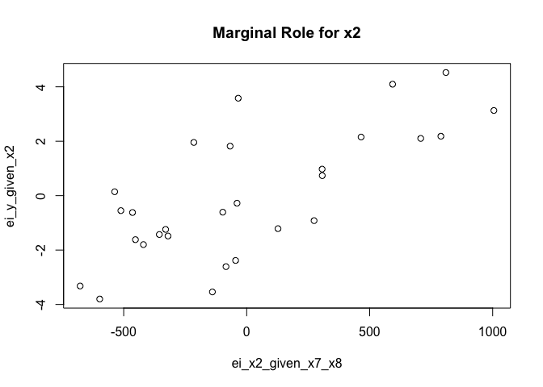<!-- -->

``` r
fitted = lm(y ~ x2 + x8)
yHat = predict(fitted)
ei_y_given_x7 = y - yHat
fitted = lm(x7 ~ x2 + x8)
yHat = predict(fitted)
ei_x7_given_x2_x8 = x7 - yHat
plot(ei_x7_given_x2_x8, ei_y_given_x7, main="Marginal Role for x7")
```

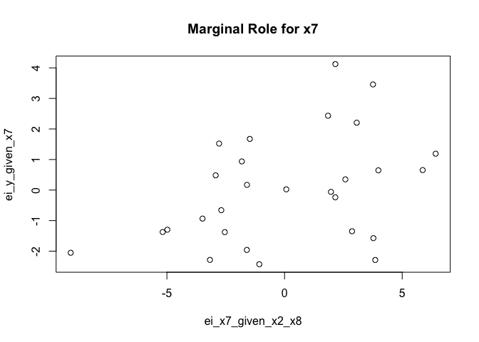<!-- -->

``` r
fitted = lm(y ~ x2 + x7)
yHat = predict(fitted)
ei_y_given_x8 = y - yHat
fitted = lm(x8 ~ x2 + x7)
yHat = predict(fitted)
ei_x8_given_x2_x7 = x8 - yHat
plot(ei_x8_given_x2_x7, ei_y_given_x8, main="Marginal Role for x8")
```

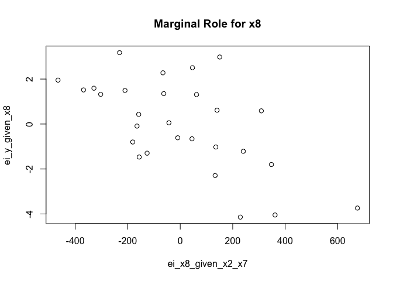<!-- -->

The partial residuals for *x*<sub>2</sub> and *x*<sub>8</sub> seem to follow upward sloped and downward sloped lines, respectively. Therefore *x*<sub>2</sub> and *x*<sub>8</sub> enter the model linearly. The partial residuals for *x*<sub>7</sub> do not follow any such pattern, therefore there isn’t an identifiable linear relationship between it and response. These results support our conclusions from part (c) on which regressors likely relate linearly to response (*x*<sub>2</sub> and certainly *x*<sub>8</sub>) and which do not (*x*<sub>7</sub>).

### Part (e)

Studentized Residuals:

``` r
studentRes
```

    ##            1            2            3            4            5            6 
    ##  2.454354223  1.239218310  1.777586702  1.031123075  0.005995537 -0.411563960 
    ##            7            8            9           10           11           12 
    ## -1.218993620  0.293574644  1.361631132 -1.476806719 -0.035701602  1.266752172 
    ##           13           14           15           16           17           18 
    ## -0.082098218 -0.157370596 -1.358701256  0.636954384 -0.192946834 -0.358322410 
    ##           19           20           21           22           23           24 
    ## -0.077345090 -0.202296957 -1.980521136  0.811437522 -0.542899513 -0.271154408 
    ##           25           26           27           28 
    ## -1.019417881 -0.092092392 -0.256979177 -1.051031132

R-student Residuals:

``` r
rStuRes
```

    ##            1            2            3            4            5            6 
    ##  2.454354223  1.239218310  1.777586702  1.031123075  0.005995537 -0.411563960 
    ##            7            8            9           10           11           12 
    ## -1.218993620  0.293574644  1.361631132 -1.476806719 -0.035701602  1.266752172 
    ##           13           14           15           16           17           18 
    ## -0.082098218 -0.157370596 -1.358701256  0.636954384 -0.192946834 -0.358322410 
    ##           19           20           21           22           23           24 
    ## -0.077345090 -0.202296957 -1.980521136  0.811437522 -0.542899513 -0.271154408 
    ##           25           26           27           28 
    ## -1.019417881 -0.092092392 -0.256979177 -1.051031132

We can use studentized and r-student residuals to identify possible outliers and influential points. The larger the studentized and r-student residuals, the more easily we can draw such a conclusion. Observation 1 could be an outlier because it has the highest studentized residual and highest r-student residual in magnitude of 2.45

## Question-3

Chapter 4, Problem 19 all parts. In addition answer the following.

### Part (a)

``` r
y=c(102,120,117,198,103,132,132,139,133,133,140,142,145,142)
x1=c(-1,1,-1,1,-1,1,-1,1,0,0,0,0,0,0)
x2=c(-1,-1,1,1,-1,-1,1,1,0,0,0,0,0,0)
x3=c(1,-1,-1,1,-1,1,1,-1,0,0,0,0,0,0)
fitted <- lm(y ~ x1+ x2+x3)
stdRes = rstandard(fitted)
rStuRes = rstudent(fitted)

qqnorm(rStuRes, main="Normal Probability Plot (residuals on y-axis)") 
qqline(rStuRes)
```

<!-- -->

``` r
qqnorm(rStuRes, datax = TRUE, main="Normal Probability Plot")
qqline(rStuRes, datax = TRUE )
```

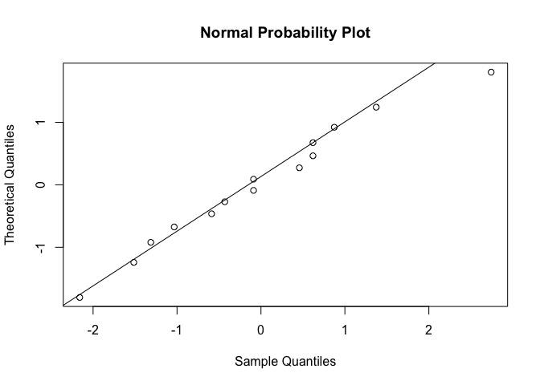<!-- -->

``` r
plot (predict(fitted), rStuRes, main="Residuals vs. Predicted Response")
abline(0,0)
```

<!-- -->

Based on the Normal Probability plot, the normality assumption is in check because the majority of the r-student residuals follow a straight linear trend. Based on the Residuals vs. Predicted Response plot, there is a pattern that is nonlinear, indicating other regressor variables/transformations on regressors may be necessary for the model.

### Part (b) 
- Select observations for PE such that rows of regressor entries are constant, ie. the final 6 rows.

``` r
y_LOF = y[9:14]
m = 9
n = 14
k = 3
SS_PE = sum(sum((y_LOF-mean(y_LOF))^2))
SS_res = sum((y - predict(fitted))^2)
SS_LOF = SS_res - SS_PE
F_0 = (SS_LOF/(m-(k+1)))/(SS_PE/(n-m))
```

*F*<sub>0</sub>: 11.80688, *p*-value: 0.0084929. Since *p*-value is lower than *α* = 0.05, we reject the null hypothesis that the model properly describes the data. Thus we conclude the regression function is not linear.

### Part (c) 
- Find the point with largest (in absolute value) r-student residual as a potential outlier. Repeat the regression analysis after deleting that point from the observation data. Construct the probability plot and residual vs predicted response plot. Calculate the differences (deleted vs full data) in fitted coefficients, *MS*<sub>res</sub> and *R*<sup>2</sup>. Comment on the differences in the plots and the values. Do you think it is an influential point? Do they imply any improvement?

``` r
rStuRes
```

    ##           1           2           3           4           5           6 
    ## -1.03360077 -0.43136984 -0.58802658  2.74240993  1.37342143 -1.51507642 
    ##           7           8           9          10          11          12 
    ## -1.31233334 -2.15936862 -0.08831923 -0.08831923  0.45767481  0.61974727 
    ##          13          14 
    ##  0.87349630  0.61974727

``` r
new_fitted <- lm(y[-4] ~ x1[-4]+ x2[-4]+x3[-4])
stdRes = rstandard(new_fitted)
rStuRes = rstudent(new_fitted)

qqnorm(rStuRes, main="Normal Probability Plot w/out Outlier (residuals on y-axis)") 
qqline(rStuRes)
```

<!-- -->

``` r
qqnorm(rStuRes, datax = TRUE, main="Normal Probability Plot w/out Outlier") 
qqline(rStuRes, datax = TRUE )
```

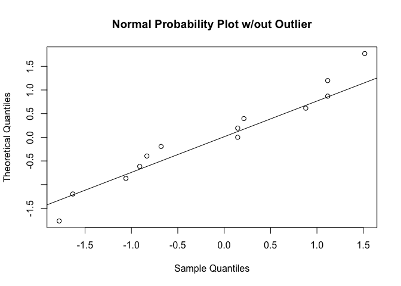<!-- -->

``` r
plot (predict(new_fitted), rStuRes, main="Residuals vs. Predicted Response w/out Outlier")
abline(0,0)
```

<!-- -->

``` r
fitted_MS_res = sum((y-predict(fitted))^2)/(n-(m+1))
new_MS_res = sum((y[-4]-predict(new_fitted))^2)/((n-1)-(m+1))

fitted_R_sq = (sum((predict(fitted)-mean(y))^2))/(sum((y-mean(y))^2))
new_R_sq = (sum((predict(new_fitted)-mean(y[-4]))^2))/(sum((y[-4]-mean(y[-4]))^2))
```

The largest r-student residual of 2.74 was for observation 4, where *x*<sub>1</sub>=1, *x*<sub>2</sub>=1, *x*<sub>3</sub>=1, *y*=198. Thus, observation 4 is a potential outlier.

Differences (fitted coefficient over deleted data - fitted coefficient over full data):

*β*<sub>0</sub>: -2.6105991

*β*<sub>1</sub>: -4.5685484

*β*<sub>2</sub>: -4.5685484

*β*<sub>3</sub>: -4.5685484

*MS*<sub>res</sub>: -111.1224558

*R*<sup>2</sup>: -0.1188627

When observation 4 is removed, the new line of best fit does not fit the data points as well, and there continues to be a pattern in the Residuals vs. Predicted Response graph. With the potential outlier removed, all estimated regressor coefficients are lower for the new fitted line. Regression coefficients 1, 2 and 3 are decreased by exactly the same amount of -4.57. This demonstrates that without observation 4, there is a weaker relationship between each regressor and observation, making it likely influential. With the outlier removed, *MS*<sub>res</sub> also decreases substantially by -64.11. This makes sense because observation 4 was so remote, causing there to be high variance, which is relieved upon removal from the data. Finally, upon removal of observation 4, *R*<sup>2</sup> decreased for the new model by -0.12. This indicates that although observation 4 may be remote, its existence makes the model a better fit for the data. I conclude that observation 4 is an influential point that is crucial to the model.
